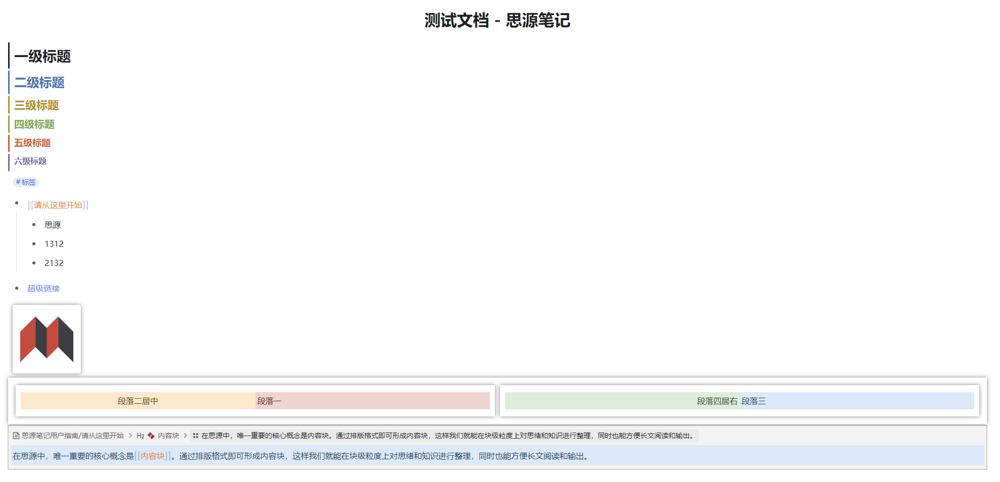

# 简介

保持官方原有界面配色和样式不变，主要修改了行级元素与块级元素，增加各元素辨识度，方便区分，同时支持明亮和暗黑主题

# 各项修改

## 展示

​

## 修改说明

* 各级标题样式
* 标签样式
* 列表辅助线悬浮高亮
* 双链样式
* 图片，超级块增加阴影以区分背景
* 引述块样式增加边框
* 文档标题居中
* 去掉了设置界面的关闭按钮，点击界面外部即可关闭

# 参考主题

* 参照dark+主题的各项元素样式
* 参照Rem Craft主题的标签样式
